# 🚀 AIbo — AI Business Companion (Decision Intelligence Platform for SMEs)

> **AIbo** adalah platform *Business Intelligence & Decision Intelligence* berbasis AI yang dirancang khusus untuk pemilik usaha kecil & menengah (UMKM/SME), manajer operasional, dan pengambil keputusan bisnis. AIbo mengubah tumpukan data bisnis yang rumit menjadi wawasan yang mudah dipahami, dapat dijelaskan (*explainable*), dan dapat dieksekusi dalam satu klik (*closed-loop action*).

---

## 📑 Daftar Isi
1. [Filosofi & Pendekatan Produk](#-filosofi--pendekatan-produk)
2. [Struktur Pohon Direktori (Project Tree)](#-struktur-pohon-direktori-project-tree)
3. [Rincian Fungsi Setiap Berkas](#-rincian-fungsi-setiap-berkas)
4. [Diagram Alur & Arsitektur Konektivitas Sistem](#-diagram-alur--arsitektur-konektivitas-sistem)
5. [Diagram Siklus Tertutup (Closed-Loop Interaction)](#-diagram-siklus-tertutup-closed-loop-interaction)
6. [Diagram Workflow Arsitektur Per Fitur Utama](#-diagram-workflow-arsitektur-per-fitur-utama)
   - [Workflow 1: Autentikasi, Registrasi OTP & Pemulihan Sandi](#1-workflow-autentikasi-registrasi-otp--pemulihan-sandi)
   - [Workflow 2: Onboarding Usaha & Inisialisasi Target Bisnis](#2-workflow-onboarding-usaha--inisialisasi-target-bisnis)
   - [Workflow 3: Executive Dashboard & Health Score 6-Dimensi](#3-workflow-executive-dashboard--health-score-6-dimensi)
   - [Workflow 4: Deep-Dive Analytics & Drill-Down Kanal Penjualan](#4-workflow-deep-dive-analytics--drill-down-kanal-penjualan)
   - [Workflow 5: Decision Center & 8-Langkah Transparansi AI](#5-workflow-decision-center--8-langkah-transparansi-ai)
   - [Workflow 6: Action Center, Goal Drivers & Eksekusi Loop Tertutup](#6-workflow-action-center-goal-drivers--eksekusi-loop-tertutup)
   - [Workflow 7: Pusat Laporan Bisnis & Simulasi Ekspor Dokumen](#7-workflow-pusat-laporan-bisnis--simulasi-ekspor-dokumen)
   - [Workflow 8: Data Center, Klasifikasi Data & Rekomendasi Integrasi](#8-workflow-data-center-klasifikasi-data--rekomendasi-integrasi)
   - [Workflow 9: Multi-Tenant State Partitioning di LocalStorage](#9-workflow-multi-tenant-state-partitioning-di-localstorage)
7. [Detail Fitur-Fitur Kunci (Phase 1 — 4.6)](#-detail-fitur-fitur-kunci-phase-1--46)
8. [Skema Data & State Management](#-skema-data--state-management)
9. [Panduan Penggunaan & Skenario Pengujian](#-panduan-penggunaan--skenario-pengujian)
10. [Panduan Deployment Vercel](#-panduan-deployment-vercel)

---

## 🎯 Filosofi & Pendekatan Produk

AIbo dibangun berdasarkan kerangka kerja kognitif 5-tahap yang memandu pemilik usaha dari pemahaman data hingga tindakan nyata:

$$\textbf{WHAT HAPPENED} \longrightarrow \textbf{WHY DID IT HAPPEN} \longrightarrow \textbf{WHAT DOES IT MEAN} \longrightarrow \textbf{WHAT SHOULD I DO} \longrightarrow \textbf{TAKE ACTION}$$

* **Tanpa Istilah Rumit:** Metrik bisnis kompleks dijelaskan dengan bahasa sehari-hari disertai contoh angka nyata.
* **Transparansi Penuh (Explainability):** Rekomendasi AI tidak berupa *black-box*, melainkan dipaparkan lewat 8 langkah bukti data, opsi komparasi, dan analisis risiko.
* **Loop Tertutup (Closed-Loop):** Setiap keputusan terhubung langsung ke otomatisasi tugas dan pembaruan KPI reaktif secara *real-time*.

---

## 🌳 Struktur Pohon Direktori (Project Tree)

```text
Aibo/
├── vercel.json                    # Konfigurasi SPA Routing & Clean URLs untuk Vercel Hosting
├── index.html                     # Entrypoint HTML & container viewport Single Page Application (#app-root)
├── index.css                      # Design System lengkap (CSS Tokens, Theme, Responsive Grid, Animations)
├── AIbo_Dummy_Data.json           # Baseline dataset bisnis default (Nusa Brew Coffee - Agustus 2026)
├── README.md                      # Dokumentasi komprehensif proyek & panduan arsitektur
└── js/
    ├── app.js                     # Root Controller: Router SPA, Layout Shell, Navigasi Desktop & Mobile, Sandbox
    ├── state.js                   # Reactive Store: Multi-Tenant LocalStorage, Approvals Engine, Subscription & Quota
    ├── i18n.js                    # Mesin penerjemah antarmuka dwibahasa (Bahasa Indonesia & English)
    ├── utils.js                   # Helper formatting Rupiah, persentase, SVG Chart, counter, toast
    └── components/
        ├── action.js              # Action Center: Task Kanban/List, Goal Drivers, Team Approvals, Report Center
        ├── analytics.js           # Analytics Suite: 6 Tab Analitik, Granularitas Waktu, Drill-Down Kanal Penjualan
        ├── auth.js                # Modul Autentikasi: Login, Register (OTP 987654), Lupa Sandi (OTP 123456)
        ├── contextHelp.js         # Kamus Istilah Bisnis: Popover modal ⓘ untuk metrik awam & contoh hitungan
        ├── dashboard.js           # Executive Dashboard: Health Gauge 6-Dimensi, Visual Month Calendar, AI Daily Brief
        ├── dataCenter.js          # Data Center: Panduan Kebutuhan Data 5-Poin, Rekomendasi Integrasi, Sync Wizard
        ├── decision.js            # Decision Center: Multi-Choice Options Selector, 8-Langkah Transparansi & Copilot
        ├── onboarding.js          # Wizard Onboarding Pengguna Baru: Profil Usaha, Target Multi-Goal, Data Checklist
        ├── profile.js             # Pengaturan & Profil: Subscription Plans, Quota Bars, Checkout QRIS/VA, Tim RBAC
        └── tour.js                # Tur Produk Interaktif: Panduan sorotan visual 11-langkah untuk pengguna pertama
```

---

## 📄 Rincian Fungsi Setiap Berkas

| Berkas | Ukuran | Fungsi & Tanggung Jawab Utama | Keterkaitan / Ekspor Kunci |
|---|---|---|---|
| `vercel.json` | 133 B | Mengatur konfigurasi hosting statis di Vercel, memastikan semua request URL diarahkan ke `index.html` (*SPA rewrites*). | Digunakan langsung oleh Vercel CLI / Git Integration. |
| `index.html` | 1.1 KB | Dokumen HTML utama yang memuat font (*Plus Jakarta Sans*, *Outfit*), stylesheet `index.css`, dan elemen `<div id="app-root">`. | Memuat `js/app.js` via `<script type="module">`. |
| `index.css` | 20.8 KB | Desain sistem modern: variabel warna HSL/HEX, tema dark/light, grid responsif (*Desktop, Tablet, Mobile*), sidebar collapsible, modal backdrop blur, dan animasi chart SVG. | Diaplikasikan ke seluruh komponen antarmuka. |
| `AIbo_Dummy_Data.json` | 19.5 KB | Dataset bisnis acuan UMKM kopi specialty (*Nusa Brew Coffee*) mencakup data omzet bulanan, kanal marketing, pelanggan, stok SKU, dan matriks target. | Dimuat oleh `js/state.js` sebagai baseline data akun demo. |
| `js/app.js` | 19.9 KB | **Router & Pengatur Layout Aplikasi**: Mengatur perpindahan rute layar (*dashboard, analytics, decision, action, data, profile, login, onboarding*), toggle sidebar desktop (260px ↔ 72px), bottom bar mobile, drawer sheet, dan Reviewer Sandbox `[ 🔧 ]`. | Ekspor: `navigate(screenId)`. |
| `js/state.js` | 18.1 KB | **Store Reaktif Multi-Tenant**: Mengelola status aplikasi dengan partisi `aibo_state_[email]` di `localStorage`, kalkulasi Health Score 6-dimensi, engine persetujuan tim (*approvals*), engine monetisasi (*subscription*), dan listener reaktif. | Ekspor: `appState`, `initState()`, `saveState()`, `resetState()`, `applyRecommendation()`, `submitApprovalRequest()`, `respondApprovalRequest()`, `upgradeSubscription()`, `completeTask()`, `completeOnboarding()`, `addTask()`, `addNotification()`. |
| `js/i18n.js` | 4.3 KB | **Kamus Internasionalisasi**: Menyimpan kamus istilah dwibahasa (ID/EN) di `localStorage('aibo_lang')` dan menyediakan helper penerjemahan teks antarmuka. | Ekspor: `t(key, fallback)`, `getLanguage()`, `setLanguage(lang)`. |
| `js/utils.js` | 8.4 KB | **Utilitas Visual & Formatting**: Pemformatan Rupiah (`formatCurrency`), persentase, pembuat chart SVG murni (*Line Chart, Donut Chart, Bar Chart*), animasi counter angka, dan toast notification. | Ekspor: `formatCurrency`, `formatPercent`, `formatNumber`, `renderLineChart`, `renderDonutChart`, `renderBarChart`, `showToast`, `animateCounter`. |
| `js/components/auth.js` | 21.3 KB | **Autentikasi & Keamanan Prototipe**: Formulir login demo cepat (Owner Ardi / Manager Nadia), registrasi akun baru dengan **verifikasi OTP (`987654`)**, dan **alur lupa kata sandi 3-langkah (OTP `123456`)**. | Ekspor: `renderLogin()`, `renderRegister()`, `logoutUser()`. |
| `js/components/onboarding.js` | 23.2 KB | **Wizard Onboarding 6-Langkah**: Pendaftaran profil usaha, pemilihan peran, tooltip skala bisnis UMKM, pemilihan target multi-goal + custom goal, checklist integrasi data, dan validasi mutu data. | Ekspor: `renderOnboarding()`. |
| `js/components/dashboard.js` | 31.9 KB | **Executive Dashboard**: Visualisasi Health Gauge 6-Dimensi, **Kalender Visual Bulanan Interaktif (Grid 7-Kolom dengan Event Badges & Modal Agenda)**, KPI cards sparkline, dan AI Daily Brief. | Ekspor: `renderDashboard()`. |
| `js/components/analytics.js` | 39.9 KB | **Deep-Dive Analytics (6 Tab)**: Tab *Sales, Profit, Customer, Marketing, Inventory, Cash Flow*. Granularitas waktu (Harian/Mingguan/Bulanan/Kuartalan), drill-down produk kanal, dan evaluasi AI 3-pertanyaan. | Ekspor: `renderAnalytics()`. |
| `js/components/decision.js` | 21.7 KB | **Pusat Keputusan Strategis**: **Selector Multi-Choice Opsi Skenario (Agresif, Seimbang, Konservatif)**, **Antrean Persetujuan Tim (Approvals)**, 8-Langkah Transparansi, dan Copilot Interaktif. | Ekspor: `renderDecision()`. |
| `js/components/action.js` | 42.0 KB | **Pusat Eksekusi & Pelaporan**: Manajemen tugas List / Kanban, **Tab Antrean Persetujuan Tim (Workflow Approvals)**, Modal Detail Target Bisnis (*Goal Drivers*), dan Pusat Laporan Bisnis dengan ekspor PDF/XLSX/CSV. | Ekspor: `renderAction()`. |
| `js/components/dataCenter.js` | 24.4 KB | **Pusat Integrasi & Panduan Data**: Katalog panduan data 5-poin (*Essential, Recommended, Optional*), kartu rekomendasi integrasi berikutnya, banner status kesiapan data 91%, jadwal pengingat, dan upload dataset wizard. | Ekspor: `renderDataCenter()`. |
| `js/components/profile.js` | 15.5 KB | **Pengaturan, Profil & Monetisasi**: Identitas legal usaha, kontak, **Tab Paket Langganan & Kuota Penggunaan (Starter/Pro/Enterprise)**, **Modal Checkout Pembayaran QRIS/VA/CC**, dan Matriks Tim. | Ekspor: `renderProfile()`. |
| `js/components/tour.js` | 10.5 KB | **Tur Produk Interaktif**: Panduan 11-langkah pengguna baru dengan sorotan elemen visual (*element highlight backdrop*), navigasi Lanjut/Kembali/Lewati, persistensi status, dan tombol restart tur di top header. | Ekspor: `initProductTour()`. |
| `js/components/contextHelp.js` | 6.7 KB | **Kamus Istilah Kontekstual**: Menyediakan tombol `ⓘ` yang memunculkan popover modal berisi definisi awam serta contoh perhitungan angka riil (AOV, ROI, CPA, Net Profit, Margin, Retention, Cash Flow, dll.). | Ekspor: `renderContextHelp()`, `bindContextHelpEvents()`. |

---

## 🏗️ Diagram Alur & Arsitektur Konektivitas Sistem

```mermaid
graph TD
    %% Storage Layer
    subgraph StorageLayer ["💾 Persistent Storage (LocalStorage Multi-Tenant)"]
        AUTH_STORE[("🔐 Sesi Auth<br/>localStorage('aibo_auth')")]
        DEMO_STORE[("📦 State Akun Demo<br/>localStorage('aibo_state_ardi@nusabrew.com')")]
        CUSTOM_STORE[("📦 State Akun Baru<br/>localStorage('aibo_state_user@email.com')")]
        JSON_BASELINE[("📄 AIbo_Dummy_Data.json<br/>(Baseline Template)")]
    end

    %% Routing & Controller
    subgraph AppShell ["🖥️ Router & App Shell (app.js)"]
        ROUTER{"🧭 Router (navigate)"}
        NAV_DESKTOP["💻 Sidebar Desktop (260px ↔ 72px)"]
        NAV_MOBILE["📱 Bottom Bar & More Drawer (390px)"]
        SANDBOX["🔧 Reviewer Sandbox Controller"]
    end

    %% Authentication & Onboarding
    subgraph Gateways ["🚪 Gerbang Akses"]
        LOGIN["🔑 Login & OTP Forgot Password (auth.js)"]
        REGISTER["📝 Register & OTP Email Verification (auth.js)"]
        ONBOARDING["🚀 6-Step Business Wizard (onboarding.js)"]
    end

    %% Business Intelligence Modules
    subgraph AppModules ["📊 Modul Solusi Bisnis"]
        DASHBOARD["📊 Executive Dashboard & Visual Calendar (dashboard.js)"]
        ANALYTICS["📈 6-Tab Deep Analytics (analytics.js)"]
        DECISION["💡 Decision Center & Multi-Choice (decision.js)"]
        ACTION["🎯 Action Center & Team Approvals (action.js)"]
        DATA_CENTER["📁 Data Center & Guidance (dataCenter.js)"]
        PROFILE["⚙️ Profile & Subscription Engine (profile.js)"]
    end

    %% Helper Injections
    subgraph Helpers ["🛠️ Shared Helper Services"]
        TOUR["🧭 11-Step Product Tour (tour.js)"]
        HELP["ⓘ Context Help Popover (contextHelp.js)"]
        UTILS["🎨 SVG Charts & Formatter (utils.js)"]
        I18N["🌐 i18n Translation Engine (i18n.js)"]
    end

    %% Connections
    AUTH_STORE --> ROUTER
    JSON_BASELINE -.-> DEMO_STORE
    JSON_BASELINE -.-> CUSTOM_STORE
    DEMO_STORE <==> ROUTER
    CUSTOM_STORE <==> ROUTER

    ROUTER --> LOGIN
    ROUTER --> REGISTER
    ROUTER --> ONBOARDING
    ROUTER --> DASHBOARD
    ROUTER --> ANALYTICS
    ROUTER --> DECISION
    ROUTER --> ACTION
    ROUTER --> DATA_CENTER
    ROUTER --> PROFILE

    NAV_DESKTOP --> ROUTER
    NAV_MOBILE --> ROUTER
    SANDBOX --> ROUTER

    HELP -.-> DASHBOARD
    HELP -.-> ANALYTICS
    UTILS -.-> DASHBOARD
    UTILS -.-> ANALYTICS
    UTILS -.-> ACTION
    I18N -.-> PROFILE
    TOUR -.-> ROUTER
```

---

## 🔄 Diagram Siklus Tertutup (Closed-Loop Interaction)

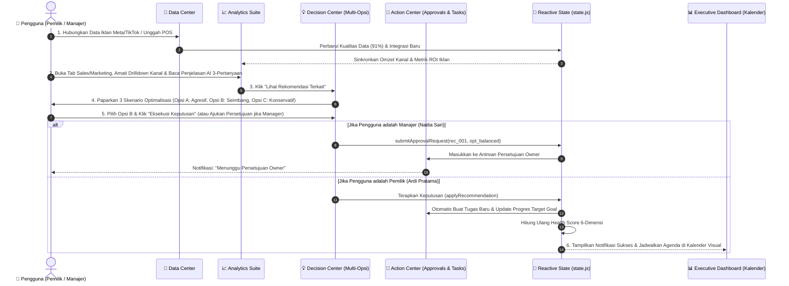

---

## 📐 Diagram Workflow Arsitektur Per Fitur Utama

---

### 1. Workflow: Autentikasi, Registrasi OTP & Pemulihan Sandi

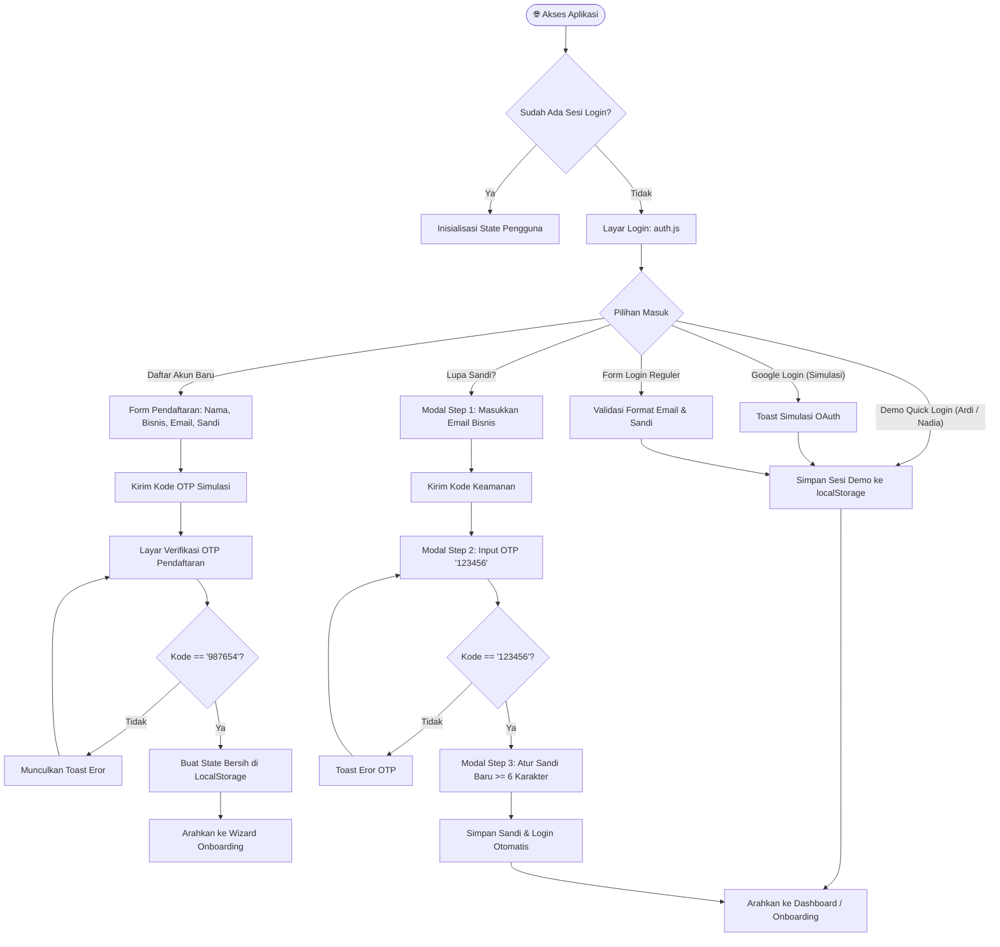

---

### 2. Workflow: Onboarding Usaha & Inisialisasi Target Bisnis

```mermaid
flowchart LR
    S1["1. Welcome<br/>Filosofi AIbo"] --> S2["2. Peran & Tim<br/>Owner/Manager/Staff"]
    S2 --> S3["3. Profil Usaha<br/>Nama, Industri, Skala, Kota"]
    S3 --> S4["4. Target Goals<br/>Preset & Custom Goal"]
    S4 --> S5["5. Checklist Data<br/>Essential/Rec/Opt"]
    S5 --> S6["6. Validasi Data<br/>Skor Kualitas 91%"]
    S6 --> FINISH["💾 Simpan ke LocalStorage<br/>(completeOnboarding)"]
    FINISH --> DASHBOARD["📊 Buka Dashboard &<br/>Mulai Tur Produk (tour.js)"]
```

---

### 3. Workflow: Executive Dashboard & Health Score 6-Dimensi

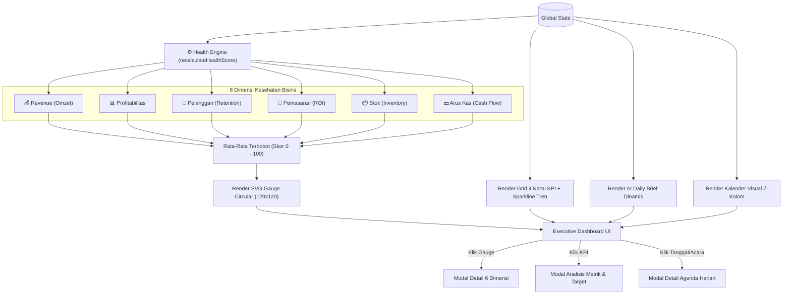

---

### 4. Workflow: Deep-Dive Analytics & Drill-Down Kanal Penjualan

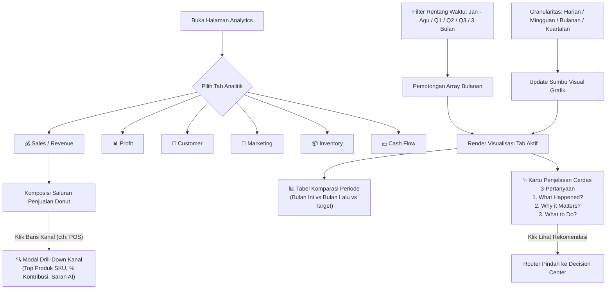

---

### 5. Workflow: Decision Center & 8-Langkah Transparansi AI

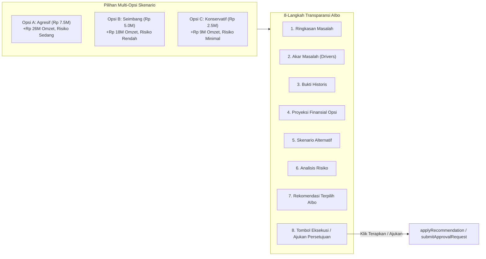

---

### 6. Workflow: Action Center, Goal Drivers & Eksekusi Loop Tertutup

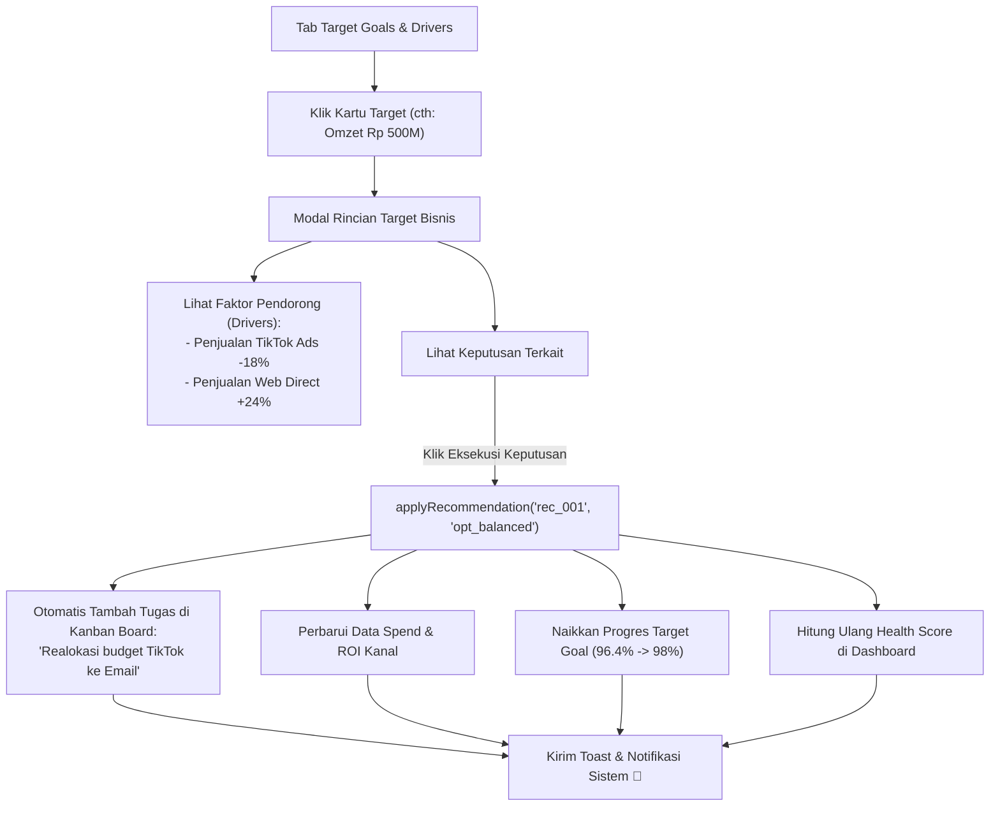

---

### 7. Workflow: Pusat Laporan Bisnis & Simulasi Ekspor Dokumen

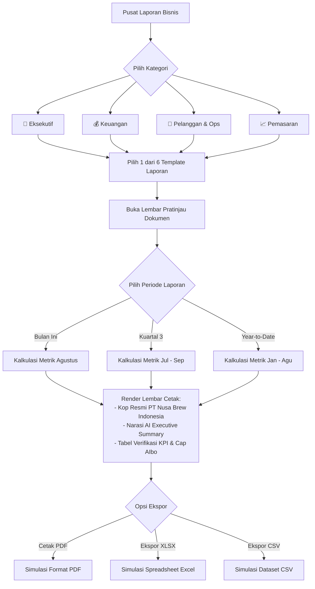

---

### 8. Workflow: Data Center, Klasifikasi Data & Rekomendasi Integrasi

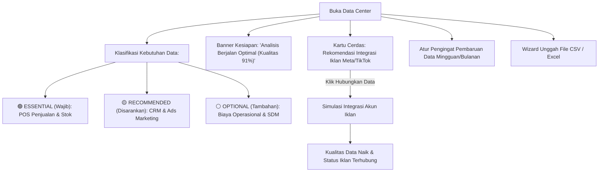

---

### 9. Workflow: Multi-Tenant State Partitioning di LocalStorage

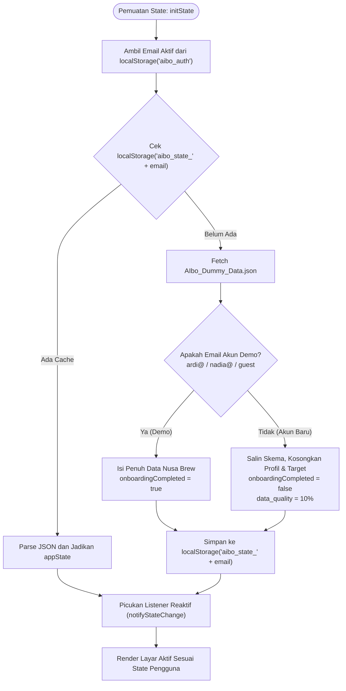

---

## ✨ Detail Fitur-Fitur Kunci (Phase 1 — 4.7)

### 1. Executive Dashboard & High-Impact Widgets
* **Skor Kesehatan 6-Dimensi SVG Circular**: Mengukur Revenue, Profitabilitas, Pelanggan, Pemasaran, Stok, dan Arus Kas.
* **Widget Kas Cair & Runway Operasional**: Menampilkan kas cair Rp 142.5M, daya tahan runway 4.8 bulan (Aman & Sehat), serta perbandingan arus masuk vs beban pengeluaran.
* **Banner Peringatan Dini Anomali Kritis**: Floating alert real-time dengan tombol tindakan cepat `[ 📦 Reorder Stok ➔ ]` dan `[ ⚡ Optimasi Iklan ]`.
* **Pita Ringkasan Progres Target Utama**: Bar progres target bulanan (Omzet Rp 500M / 96.4%) dengan estimasi AIbo Rp 512M dan klik interaktif membuka faktor pendorong (*drivers*).
* **Kalender Visual Bulanan Interaktif & Agenda Mandiri**: Grid 7-kolom (Senin–Minggu), badge kategori acara (Ads, Stok, Tugas, Catatan, Goals), tombol tambah agenda mandiri (`addCustomCalendarEvent`), dan modal detail agenda.

### 2. Multi-Choice Optimalisasi Keputusan di Decision Center
* 3 pilihan skenario per rekomendasi: **Opsi A (Agresif)**, **Opsi B (Seimbang)**, dan **Opsi C (Konservatif)**.
* Kalkulasi trade-off finansial dinamis dan pemilihan opsi saat eksekusi.

### 3. Alur Kerja Persetujuan Tim (*Team Workflow Approvals*)
* Manajer dapat mengajukan permohonan keputusan ke Owner (`submitApprovalRequest`).
* Owner memiliki antrean persetujuan (*Approval Queue*) di Decision Center & Action Center untuk menyetujui (*Approve*) atau menolak (*Reject*).

### 4. Sistem Monetisasi & Paket Langganan (*Subscription & Billing*)
* Pelacak kuota penggunaan AI Copilot, Integrasi Platform, dan Kursi Anggota Tim.
* Matriks perbandingan 3 paket: **Starter UMKM (Rp 0)**, **Pro SME (Rp 299.000/bln)**, dan **Enterprise (Rp 899.000/bln)** dengan diskon 20% tahunan.
* Modal simulasi checkout pembayaran dengan **QRIS**, **Virtual Account (BCA, Mandiri, BRI)**, dan **Kartu Kredit**.

### 5. Sistem Multi-Tenant LocalStorage Sandbox
* State disimpan per-email: `aibo_state_[email]`.
* Akun demo memuat Nusa Brew Coffee, akun pendaftar baru dimulai dari profil bersih/kosong.

### 6. Autentikasi dengan Sesi OTP Realistis
* Registrasi Akun Baru: OTP **`987654`**.
* Pemulihan Lupa Sandi: OTP **`123456`**.

### 7. Health Score 6-Dimensi & AI Daily Brief
* Mengukur kesehatan bisnis secara komprehensif: **Revenue, Profitabilitas, Pelanggan, Pemasaran, Stok, dan Arus Kas**.

### 8. 8-Langkah Transparansi Keputusan (*Decision Explainability*)
* Ringkasan, Akar Masalah, Bukti Data, Proyeksi Finansial, Opsi Alternatif, Analisis Risiko, Rekomendasi, dan Tombol Tindakan 1-Klik.

### 9. Goal Closed-Loop & Advanced Report Center
* Goal Drivers Detail dengan eksekusi 1-klik dan 6 template laporan resmi dengan ekspor simulasi PDF/XLSX/CSV.

### 10. Eksplorasi Visual & Drill-Down Analitik
* Granularitas Waktu (Harian/Mingguan/Bulanan/Kuartalan), Drilldown Saluran Penjualan, dan Penjelasan Cerdas 3-Pertanyaan.

### 11. Tur Produk & Kamus Istilah Kontekstual
* Tur produk 11-langkah berpandu dan popover kamus istilah `ⓘ` dengan contoh hitungan konkret.

---

## 📊 Skema Data & State Management

Objek status global (`appState`) di `js/state.js` memiliki struktur data sebagai berikut:

```typescript
interface AIboState {
  meta: { dataset_name: string; version: string; currency: "IDR" };
  business: {
    name: string;
    legal_name?: string;
    industry: string;
    sub_industry: string;
    scale: "Mikro" | "Kecil" | "Menengah";
    employee_count?: number;
    business_model?: "B2C" | "B2B" | "Hybrid";
    address?: string;
    city?: string;
    province?: string;
    phone?: string;
    email?: string;
    website?: string;
    description?: string;
    main_products?: string;
    channels?: string;
  };
  user: { name: string; role: "Owner" | "Manager" | "Finance" | "Marketing"; email: string };
  subscription: {
    plan: "Starter UMKM" | "Pro SME" | "Enterprise Tier";
    tier: "starter" | "pro" | "enterprise";
    billing_cycle: "monthly" | "annual";
    renewal_date: string;
    price: number;
    payment_method?: string;
    quota: {
      ai_prompts: { used: number; max: number };
      integrations: { used: number; max: number };
      team_seats: { used: number; max: number };
    };
  };
  approvals: Array<{
    id: string;
    rec_id: string;
    title: string;
    category: string;
    requested_by: string;
    requested_at: string;
    status: "pending" | "approved" | "rejected";
    option_id: string;
    option_title: string;
    amount: number;
    financial_impact: string;
    notes?: string;
    reviewed_by?: string;
    reviewed_at?: string;
    review_notes?: string;
  }>;
  business_health: {
    score: number;
    previous_score: number;
    score_change: number;
    status: "Healthy" | "Warning" | "Critical";
    components: {
      revenue: number;
      profitability: number;
      customers: number;
      marketing: number;
      inventory: number;
      cashflow: number;
    };
  };
  kpis: {
    revenue: { current: number; previous: number; target: number; change_percent: number };
    profit: { current: number; previous: number; target: number; change_percent: number };
    profit_margin: { current: number; previous: number; target: number };
    customers: { current: number; previous: number; target: number; change_percent: number };
    average_order_value: { current: number; previous: number; change_percent: number };
    marketing_roi: { current: number; target: number };
    inventory_health: { current: number; target: number };
  };
  revenue: { monthly: Array<{ month: string; revenue: number }>; channels: Array<{ channel: string; revenue: number; percentage: number }> };
  profit: { monthly: Array<{ month: string; profit: number; margin: number }> };
  customers: { summary: { total: number; new_this_month: number; retention_rate: number; churn_rate: number; returning: number }; monthly: Array<{ month: string; customers: number }>; segments: Array<{ name: string; percentage: number; customers: number }> };
  marketing: { spend: number; revenue_attributed: number; roi: number; conversion_rate: number; cost_per_acquisition: number; channels: Array<{ channel: string; spend: number; revenue: number; roi: number; conversions: number }> };
  inventory: { health_score: number; total_items: number; low_stock_count: number; overstock_count: number; low_stock_skus: number; healthy_skus: number; items: Array<{ id: string; sku: string; name: string; category: string; stock: number; reorder_point: number; unit_price: number; unit: string; status: "healthy" | "low_stock" | "overstock" }> };
  goals: Array<{ id: string; name: string; category: string; target: number; current: number; progress: number; status: "on_track" | "at_risk" | "completed"; deadline: string; priority: "High" | "Medium" | "Low"; forecast?: number; explanation?: string }>;
  recommendations: Array<{ id: string; title: string; category: string; impact: string; confidence: number; effort: string; status: "pending" | "applied" | "dismissed"; evidence: string; root_cause: string; financial_impact: string; options: Array<{ title: string; desc: string }>; risk: string; action_text: string; chosen_option?: string }>;
  tasks: Array<{ id: string; title: string; source: string; priority: string; assignee: string; status: "todo" | "in_progress" | "completed"; due_date: string; related_goal?: string }>;
  integrations: Array<{ id: string; name: string; type: string; status: "connected" | "disconnected" | "syncing"; last_sync: string }>;
  data_quality: { overall_score: number; issues: string[] };
  notifications: Array<{ id: string; type: string; title: string; message: string; time: string; read: boolean }>;
  activity: Array<{ id: string; user: string; action: string; object: string; time: string }>;
  onboardingCompleted: boolean;
  onboardingStep: number;
}
```

---

## 🧪 Panduan Penggunaan & Skenario Pengujian

### Skenario 1: Menguji Kalender Visual di Dashboard
1. Buka Executive Dashboard.
2. Amati grid kalender bulan Agustus 2026 dengan badge acara (*Marketing 📢, Stok 📦, Tugas 🎯, Goals 🏁*).
3. Klik tanggal 20 atau 22 Agustus untuk membuka **Modal Detail Agenda Harian**.
4. Klik tombol **`[ Buka Rekomendasi di Decision Center ➔ ]`** untuk navigasi langsung.

### Skenario 2: Menguji Multi-Opsi Optimalisasi Keputusan
1. Buka menu **Decision Center**.
2. Pada kartu rekomendasi pertama, pilih **Opsi A (Agresif)** vs **Opsi B (Seimbang)** vs **Opsi C (Konservatif)**.
3. Perhatikan: Proyeksi dampak finansial berubah seketika (+Rp 26M vs +Rp 18M vs +Rp 9M).
4. Klik **`[ Eksekusi Skenario ]`** untuk menerapkan opsi yang dipilih.

### Skenario 3: Menguji Alur Persetujuan Tim (Manager $\rightarrow$ Owner)
1. Logout dan masuk sebagai **Manager (Nadia Sari)**.
2. Buka Decision Center $\rightarrow$ Klik tombol **`[ 📤 Ajukan Persetujuan ke Owner ]`**.
3. Notifikasi toast sukses muncul dan permohonan masuk antrean.
4. Logout dan masuk kembali sebagai **Owner (Ardi Pratama)**.
5. Buka tab **`⏳ Persetujuan Tim`** di Action Center atau Decision Center $\rightarrow$ Klik **`[ ✓ Setujui (Approve) ]`**.
6. Keputusan langsung dieksekusi secara otomatis dan tugas dibuat di tim!

### Skenario 4: Menguji Upgrade Paket Langganan (Monetisasi)
1. Buka menu **Pengaturan & Profil Bisnis** $\rightarrow$ klik tab **`💳 Paket Langganan & Kuota`**.
2. Amati pengukur kuota (*AI Prompt 42/100, Integrasi 3/5*).
3. Klik tombol **`🚀 Upgrade ke Pro SME`**.
4. Pilih metode pembayaran **QRIS** atau **Virtual Account BCA**.
5. Klik **`[ Selesaikan Pembayaran Simulasi ]`**.
6. Akun Anda berhasil di-upgrade ke **Pro SME** dan kuota AI langsung bertambah menjadi 500 prompt!

---

## 🚀 Panduan Deployment Vercel

Aplikasi telah memenuhi 100% standar static hosting Vercel.

### Cara Deploy via Vercel CLI:
```bash
# 1. Pastikan Anda berada di root direktori proyek
cd Aibo

# 2. Jalankan perintah deploy Vercel
npx vercel

# 3. Ikuti instruksi di terminal (default settings: Static Site)
```

---

**AIbo — Empowering SME Decisions with Artificial Intelligence.**
